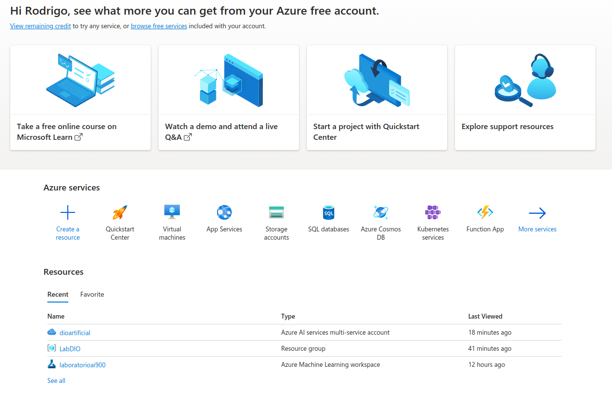
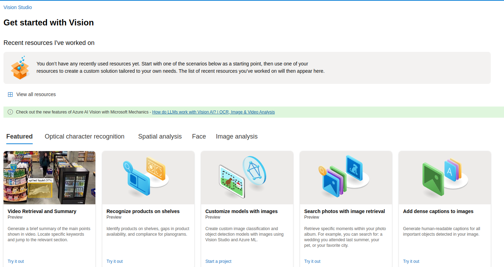

# dioMLVisionStudio

Desafio trabalhando Visão Computacional

## Desafio

Chegou a hora de você construir um portfólio ainda mais rico e impressionar futuros recrutadores, para isso é sempre importante mostrar os resultados do seu esforço e como você os obteve deixando claro o seu racional, para isso faça da seguinte maneira:

1. Crie um novo repositório no github com um nome a sua preferência
2. Crie uma pasta chamada 'inputs' e salve as imagens que você utilizou
3. Crie uma pasta chamado 'output' e salve os resultados de reconhecimento de texto nessas imagens
4. Crie um arquivo chamado readme.md , deixe alguns prints descreva o processo, alguns insights e possibilidades que você aprendeu durante o conteúdo.
5. Compartilhe conosco o link desse repositório através do botão 'entregar projeto'

##Criação do Recurso no Portal Azure

Selecionar _*Create a resource*_

Na barra de pesquisa digitar _*Azure AI Services*_ e em seguida CREATE RESOURCE

Você deverá inserir os dados de seu recurso, como nome, assinatura, grupo de recursos, localização e plano de preço.

Vá em https://portal.vision.cognitive.azure.com/

Selecione o recurso criado

Selecione a feature que deseja utilizar,

Veja a magica acontecer
